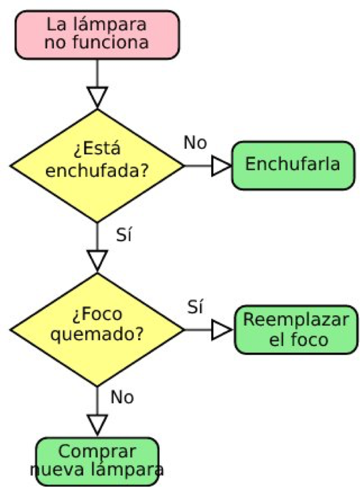

# Lab JS 3.3.3

## Descripción

Este laboratorio contiene ejercicios prácticos para reforzar el uso de condicionales en JavaScript. Cada ejercicio plantea una situación cotidiana donde deberás aplicar lógica condicional para resolver problemas.

---

## Ejercicios

### 1. Entrada Discoteca

Solicita al usuario su edad y muestra un mensaje diferente según si es mayor, menor o igual a 18 años.

### 2. Cinco Colores

Pide al usuario que elija un color entre azul, verde, rojo, amarillo o violeta. Muestra un mensaje personalizado para cada color. Si el usuario elige un color diferente, muestra un mensaje alternativo.

### 3. Lámpara No Enciende

Realiza dos preguntas al usuario (respuestas sí/no) para diagnosticar por qué una lámpara no funciona, siguiendo el diagrama de flujo proporcionado.

---

## Instrucciones

1. Lee atentamente cada enunciado.
2. Escribe el código JavaScript necesario para resolver cada ejercicio.
3. Prueba tus soluciones y verifica que los mensajes sean correctos según las condiciones.
4. Consulta el diagrama de flujo para el ejercicio 3.

---

